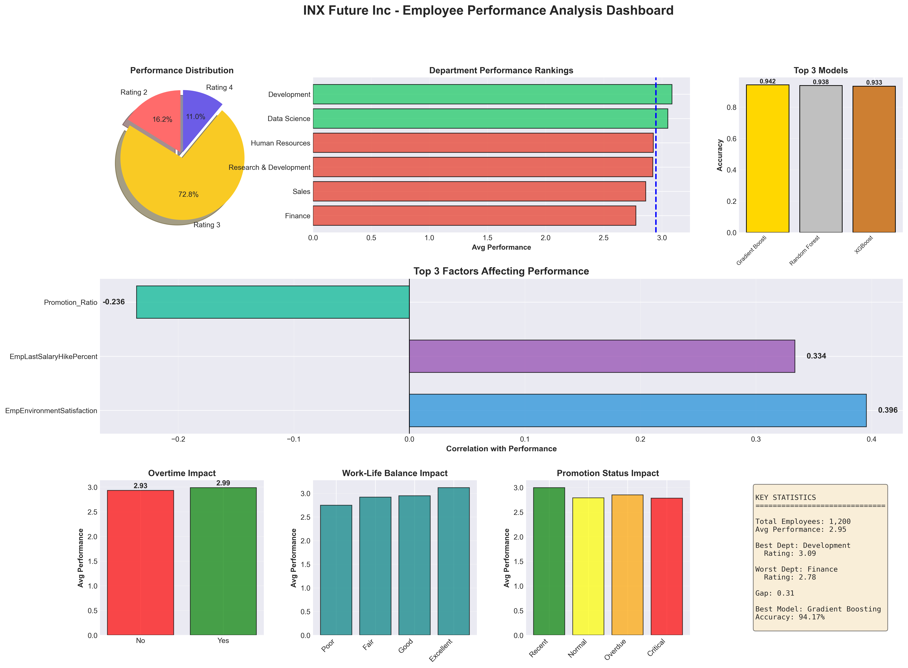

# INX Future Inc Employee Performance Analysis Project

## Project Overview

INX Future Inc is a leading data analytics and automation solutions provider with over 15 years of global business presence. This project aims to analyze employee performance data to identify underlying causes of declining performance indexes and provide actionable recommendations.

## Business Problem

- Employee performance indexes are declining
- Service delivery escalations have increased
- Client satisfaction decreased by 8 percentage points
- Need to identify non-performing employees without affecting overall morale
- Maintain reputation as a top employer while addressing performance issues

## Project Objectives

1. **Department-wise Performance Analysis**: Identify which departments are underperforming
2. **Key Performance Factors**: Identify top 3 factors affecting employee performance
3. **Predictive Model**: Build a model to predict employee performance for hiring decisions
4. **Recommendations**: Provide data-driven recommendations to improve performance

## Project Structure

```
INX_Performance_Project/
├── README.md
├── Project Summary/
│   └── project_summary.md
├── Requirement/
│   └── requirements.txt
├── Analysis/
│   └── analysis_report.md
├── Summary/
│   └── executive_summary.md
├── data/
│   ├── raw/              # Original data files
│   ├── processed/        # Cleaned and processed data
│   └── external/         # Additional reference data
├── src/
│   ├── data_processing/
│   │   ├── data_processing.ipynb
│   │   └── data_exploratory_analysis.ipynb
│   ├── models/
│   │   ├── train_model.ipynb
│   │   └── predict_model.ipynb
│   └── visualization/
│       └── visualize.ipynb
└── references/
    └── data_dictionary.md
```

## Getting Started

1. Place the employee data file in `data/raw/`
2. Install required packages: `pip install -r Requirement/requirements.txt`
3. Run notebooks in order:
   - `data_processing.ipynb`
   - `data_exploratory_analysis.ipynb`
   - `train_model.ipynb`
   - `visualize.ipynb`
   - `predict_model.ipynb`

## Performance Dashboard

Comprehensive analysis dashboard showing model performance, department rankings, and key performance factors:



## Key Technologies

- Python 3.8+
- Pandas, NumPy for data processing
- Scikit-learn for machine learning
- Matplotlib, Seaborn for visualization
- Jupyter Notebook for analysis

## Data Source

Employee Performance Data: INX_Future_Inc_Employee_Performance_CDS_Project2_Data_V1.8.xls

## Author

Data Science Team - INX Future Inc Performance Analysis Project
